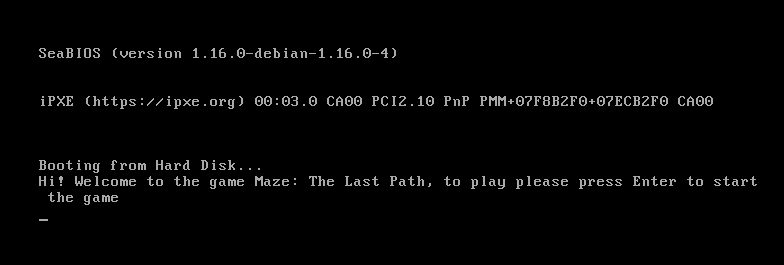
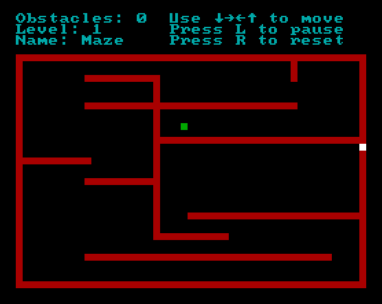
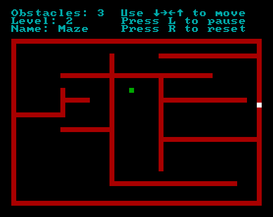
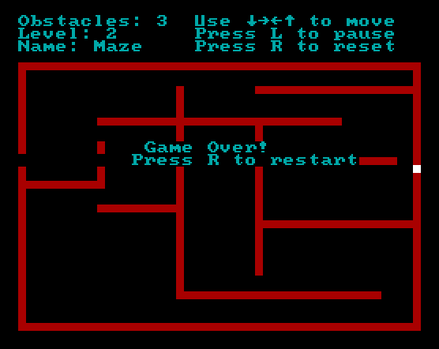

# Mobile Maze Bootable

For the implementation of this task, it will be necessary to consider that a program (boot loader) will be implemented in assembly, which is capable of executing an application called "Mobile maze bootable". 
This is a bootloader for x86 architecture that loads a simple maze game, handling interrupts, basic Text-based User Interface in assembly language.

The fundamental idea of this game is to create a series of obstacles that a ship must dodge in order to achieve the objective. The game will have a ship that can be moved in the 4 directions, which will be directed by the user using the 4 arrow keys. The fundamental idea of the game is to move the ship from the left side to the right side of the screen. To pass each maze, the ship must exit through a hole just the size of the ship. This exit will be at the far right of the screen. Figure 1 shows an example of the obstacles expected for each maze. These obstacles can move up and down randomly in order to make it difficult for the ship to pass.

The game will have two levels of difficulty and the user will win when the second level is passed. Some simple animation should be provided when the game is won.

## Dependencies
- NASM Compiler

```gas:
sudo apt-get update
```

```gas:
sudo apt-get -y install nasm
```

## Compilation
To compile run `make`, this will create a file named `boot.bin`, this file can then be burned into a disk image or runned through a simulator.

## Simulation
During developing, for simulation we used `QEMU` [QEMU](https://www.qemu.org/), you can follow the instructions to install it ion the project's webpage.
You can run `make simulate` to start a QEMU simulation.

Then you will get something like: 



The first level of the game:



The second level:



Finally, when you win, you will get the next message:




## Developers
- Josué Araya
- Pablo Carmona
- Jonathan Guzmán
- Kevin Zeledón